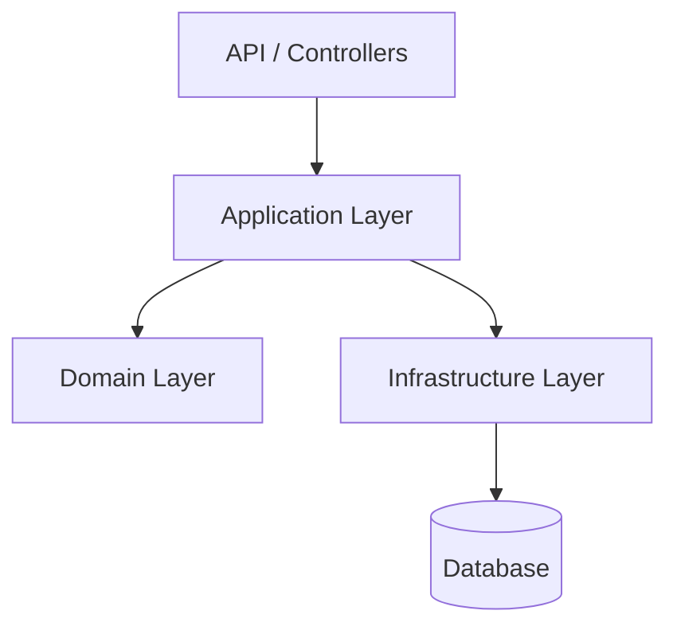

# Task Tracker

Aplicação para gerenciamento de projetos, demandas e usuários, desenvolvida com ASP.NET Core.

## 📌 Tabela de conteúdo
* [Tecnologias](#-tecnologias)
* [Pré-requisitos](#-pré-requisitos)
* [Convenções](#️-convenções)
* [Arquitetura do projeto](#️-arquitetura-do-projeto)
  * [O que é Clean Architecture?](#o-que-é-clean-architecture)
  * [Como gerar um projeto Clean Architecture?](#como-gerar-um-projeto-clean-architecture)
* [Como executar o projeto](#️-como-executar-o-projeto)
* [Documentação](#-documentação)

## 🚀 Tecnologias
* [.NET](https://dotnet.microsoft.com/pt-br/)
* [ASP.NET Core](https://dotnet.microsoft.com/pt-br/apps/aspnet)
* [Scalar](https://scalar.com/)
* [Entity Framework Core](https://learn.microsoft.com/pt-br/ef/)
* [SQLite](https://sqlite.org/index.html)

## 📋 Pré-requisitos
* [Git](https://git-scm.com/)
* [.NET SDK 10+](https://dotnet.microsoft.com/pt-br/download/dotnet/10.0)

## ✍️ Convenções
Esse repositório adota as especificações de:
* [Branches convencionais](https://conventional-branch.github.io/pt-br/)
* [Commits convencionais](https://www.conventionalcommits.org/pt-br/v1.0.0/)

## 🏗️ Arquitetura do projeto

Esse repositório segue o padrão [Clean Architecture](https://www.geeksforgeeks.org/system-design/complete-guide-to-clean-architecture/)

### O que é Clean Architecture?

É uma **abordagem de design de software** que promove a separação de responsabilidades, favorecendo a **manutenibilidade, escalabilidade e testabilidade**.  

Seu objetivo é organizar o código em camadas distintas, cada uma com responsabilidades bem definidas, onde as **camadas internas não dependem das implementações das camadas externas, reduzindo o acoplamento com serviços externos**.



### Como gerar um projeto Clean Architecture?

#### Windows

```bash
# CONFIGURA NOME DO PROJETO
$ProjectName = "TaskTracker"

# CRIA O DIRETÓRIO RAIZ
mkdir $ProjectName
cd $ProjectName

# CRIA A SOLUÇÃO
dotnet new sln -n $ProjectName

# CRIA OS DIRETÓRIOS DOS PROJETOS
mkdir src
mkdir tests

# CRIA OS PROJETOS
dotnet new classlib -n "$ProjectName.Domain"         -o "src/$ProjectName.Domain"
dotnet new classlib -n "$ProjectName.Application"    -o "src/$ProjectName.Application"
dotnet new classlib -n "$ProjectName.Infrastructure" -o "src/$ProjectName.Infrastructure"
dotnet new webapi   -n "$ProjectName.API"            -o "src/$ProjectName.API"

# ADICIONA OS PROJETOS A SOLUÇÃO
dotnet sln add "src/$ProjectName.Domain/$ProjectName.Domain.csproj"
dotnet sln add "src/$ProjectName.Application/$ProjectName.Application.csproj"
dotnet sln add "src/$ProjectName.Infrastructure/$ProjectName.Infrastructure.csproj"
dotnet sln add "src/$ProjectName.API/$ProjectName.API.csproj"

# ADICIONA AS REFERÊNCIAS
dotnet add "src/$ProjectName.Application/$ProjectName.Application.csproj" reference "src/$ProjectName.Domain/$ProjectName.Domain.csproj"

dotnet add "src/$ProjectName.Infrastructure/$ProjectName.Infrastructure.csproj" reference "src/$ProjectName.Application/$ProjectName.Application.csproj"
dotnet add "src/$ProjectName.Infrastructure/$ProjectName.Infrastructure.csproj" reference "src/$ProjectName.Domain/$ProjectName.Domain.csproj"

dotnet add "src/$ProjectName.API/$ProjectName.API.csproj" reference "src/$ProjectName.Application/$ProjectName.Application.csproj"
dotnet add "src/$ProjectName.API/$ProjectName.API.csproj" reference "src/$ProjectName.Infrastructure/$ProjectName.Infrastructure.csproj"
```

## ⚙️ Como executar o projeto

### 1. Clone o repositório.
```bash
git clone https://github.com/MauroRaya/task-tracker
```

### 2. Mude para o diretório do projeto.
```bash
cd task-tracker
```

### 3. Instale os pacotes.
```bash
dotnet restore
```

### 4. Compile a aplicação.
```bash
dotnet build
```

### 5. Inicie a aplicação.
```bash
dotnet run --project src/TaskTracker.API/TaskTracker.API.csproj
```

## 📝 Documentação

Esse repositório utiliza o [Scalar](https://scalar.com/) para documentação, disponivel no caminho `/scalar`

```bash
http://localhost:5093/scalar
```
